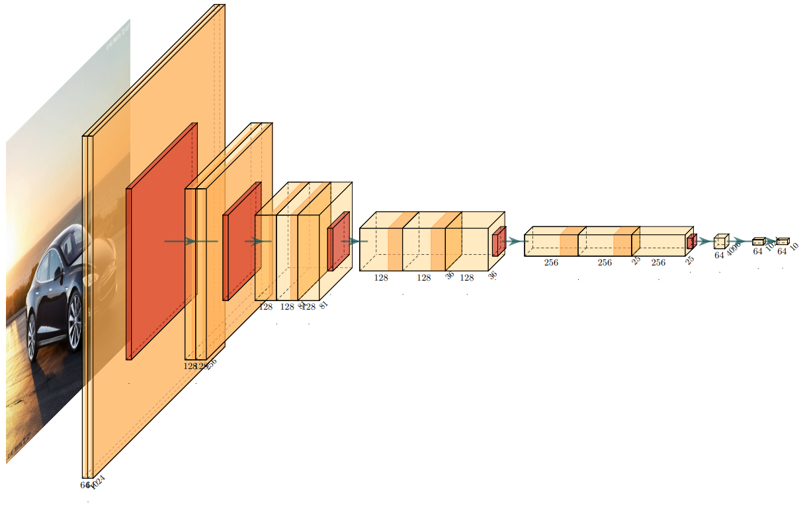
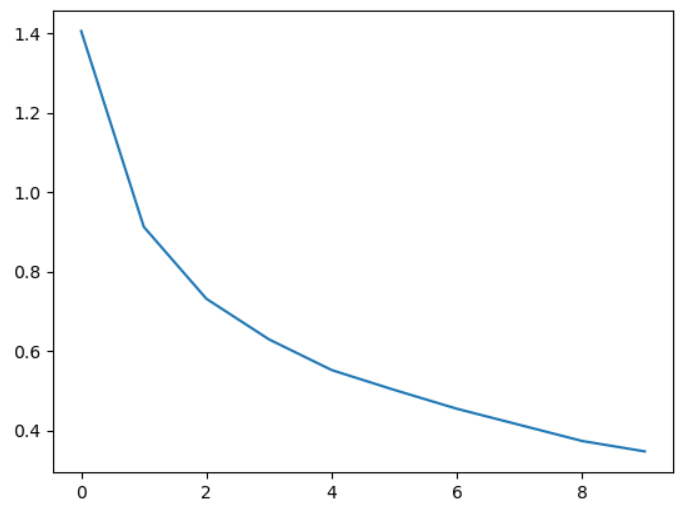
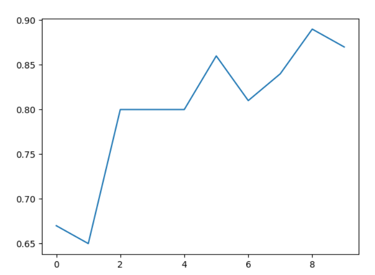
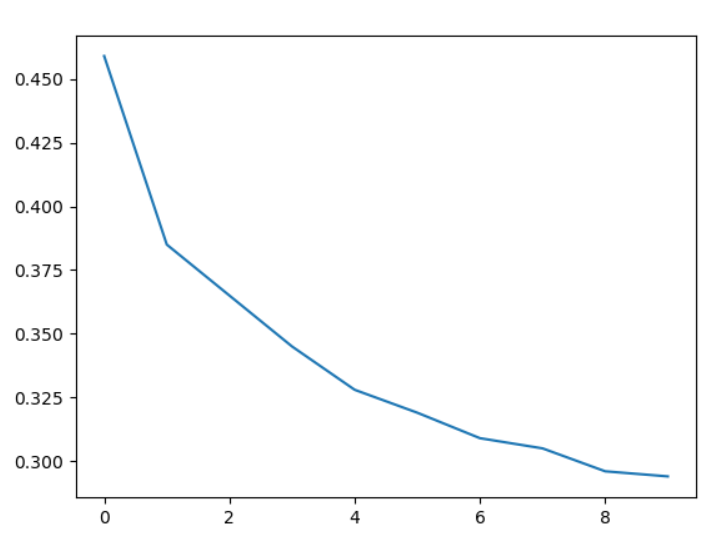
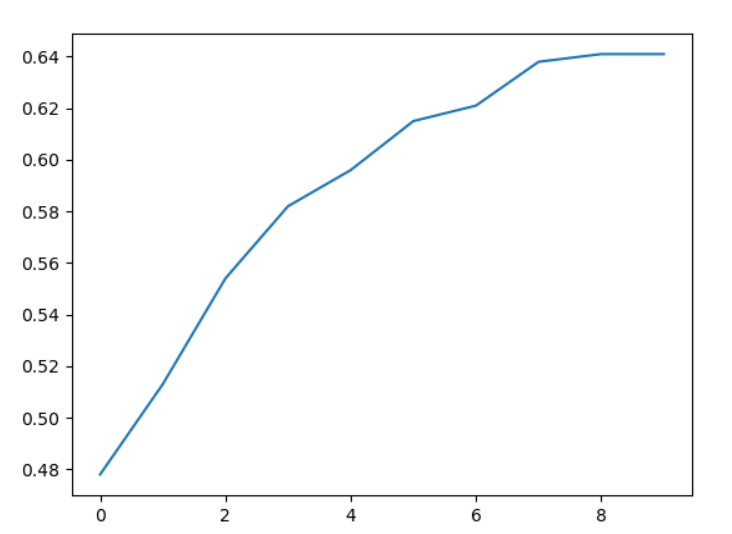
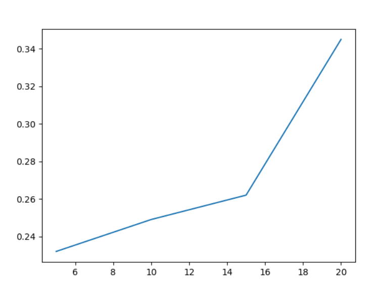

# 人工智能实验五 实验报告

| 成员姓名 |                        |
| -------- | ---------------------- |
| **班级** | **18级计算机科学二班** |

## 一、 卷积神经网络CNN

### 1. 算法原理

#### 1.1 卷积的原理

一维卷积经常用在信号处理中，用于计算信号的延迟累积。假设一个信号发生器每个时刻$t$产生一个信号$x^t$,$k$个时间 后的信息衰减率为$w^k$，则当前信号输出$t_t$为：
$$
y_t=\sum^m_{k=1}w_k\times x_{t-k+1}
$$
二维卷积经常用在图像处理中，因为图像通常为一个两维结构，所以需要将一维卷积进行扩展。使用如下公式进行二维卷积：
$$
y_{i,j}=\sum^m_{u=1}\sum^n_{v=1}w_{u,v}\times x_{i-u+1,j-v+1}
$$
二维卷积广泛地被用在图像处理中，可以起到特征提取的作用。

#### 1.2 卷积层和池化层

卷积神经网络是一种 基于生物学上感受野的机制，其中感受野主要是指听觉、视觉等神经系统中一些神经元的特性，即神经元只接受其所支配的刺激区域内的信号。在视觉神经系统中，一个神经元的感受野是指视网膜上的特定区域，只有这个区域内的刺激才能够激活该神经元。

卷积神经网络有三个结构上的特征：

- 局部连接
- 权重共享
- 空间上的下采样

卷积层有三个参数：

- 深度：卷积核的深度，和输入图像的通道数相等
- 步长：卷积核每次移动的像素数
- 填充：在原图像周围拓展值为0的像素

对于输入特征为$X^1,X^2,...,X^D$的卷积层，先用卷积核$W^{p,1},W^{p,2},...,W^{p,D}$分别对这些特征做卷积，然后将卷积的结果相加，并加上一个偏置标量$b^p$得到$z^p$，最后通过定义好的激活函数得到卷积层的输出$Y^p$。

卷积层虽然可以显著减少网 络中参数的数量，但特征映射输出的维度仍然很高。池化层对输入特征映射组进行下采样，进一步的筛选特征，降低特征数量，并从而减少参数数量，缩减模型的大小，提高计算速度，同时提高所提取特征的鲁棒性。最常用到的池化类型是最大池化，大小与步长均设置为2，效果相当于原来的特征高度和宽度缩减一半。

#### 1.3 卷积神经网络

卷积神经网络由卷积层、池化层、全连接层交叉堆叠而成。首先定义一个卷积块为连续M个卷积层和b个池化层，一个卷积网络中首先堆叠N个连续的卷积块，最后再连接K个全连接层，得到最终的结果。

本次的实验中，将图片作为输入，经过一系列卷积、池化操作后，在全连接层中得到最后的分类结果。

### 2. 网络结构

网络结构部分代码如下：

```py
class Net(nn.Module):
    def __init__(self):
        super(Net, self).__init__()
        #1st segment
        self.conv1 = nn.Conv2d(3, 64, 3, padding=1)
        self.conv2 = nn.Conv2d(64, 64, 3, padding=1)
        self.pool1 = nn.MaxPool2d(2, 2)
        self.bn1 = nn.BatchNorm2d(64)
        self.relu1 = nn.ReLU()

        #2nd segment
        self.conv3 = nn.Conv2d(64, 128, 3, padding=1)
        self.conv4 = nn.Conv2d(128, 128, 3, padding=1)
        self.pool2 = nn.MaxPool2d(2, 2, padding=1)
        self.bn2 = nn.BatchNorm2d(128)
        self.relu2 = nn.ReLU()

        #3rd segment
        self.conv5 = nn.Conv2d(128, 128, 3, padding=1)
        self.conv6 = nn.Conv2d(128, 128, 3, padding=1)
        self.conv7 = nn.Conv2d(128, 128, 1, padding=1)
        self.pool3 = nn.MaxPool2d(2, 2, padding=1)
        self.bn3 = nn.BatchNorm2d(128)
        self.relu3 = nn.ReLU()

        #4th segment
        self.conv8 = nn.Conv2d(128, 256, 3, padding=1)
        self.conv9 = nn.Conv2d(256, 256, 3, padding=1)
        self.conv10 = nn.Conv2d(256, 256, 1, padding=1)
        self.pool4 = nn.MaxPool2d(2, 2, padding=1)
        self.bn4 = nn.BatchNorm2d(256)
        self.relu4 = nn.ReLU()

        #5th segment
        self.conv11 = nn.Conv2d(256, 256, 3, padding=1)
        self.conv12 = nn.Conv2d(256, 256, 3, padding=1)
        self.conv13 = nn.Conv2d(256, 256, 1, padding=1)
        self.pool5 = nn.MaxPool2d(2, 2, padding=1)
        self.bn5 = nn.BatchNorm2d(256)
        self.relu5 = nn.ReLU()

        #FC segment
        self.fc14 = nn.Linear(256 * 4 * 4, 1024)
        self.drop1 = nn.Dropout2d()
        self.fc15 = nn.Linear(1024, 1024)
        self.drop2 = nn.Dropout2d()
        self.fc16 = nn.Linear(1024, 10)
```



### 3. 结果分析

十次迭代后的结果如下：

| 训练次数   | 0      | 1      | 2      | 3      | 4      | 5      | 6      | 7      | 8      | 9      |
| ---------- | ------ | ------ | ------ | ------ | ------ | ------ | ------ | ------ | ------ | ------ |
| 交叉熵loss | 1.4063 | 0.9134 | 0.7322 | 0.6300 | 0.5528 | 0.5028 | 0.4553 | 0.4148 | 0.3742 | 0.3480 |
| 准确率     | 67%    | 65 %   | 80 %   | 80%    | 80 %   | 86 %   | 81%    | 84%    | 89%    | 87%    |

交叉熵和准确率随着训练次数的变化如下图所示：





可以看出，随着训练次数的增加，损失函数值明显地下降了。虽然准确率有一定波动，但整体呈现上升趋势。

我们在网上找到了[FPN特征金字塔网络](https://github.com/jwyang/fpn.pytorch)的实现，通过对每一种尺度的图像进行特征提取，产生多尺度的特征表示，并且所有等级的特征图都具有较强的语义信息，甚至包括一些高分辨率的特征图。FPN能够有效解决低层特征图语义信息不够和低层特征图的分辨率不高的问题。在相同的数据集下，使用该代码得到的结果为：

| 训练次数   | 0     | 1      | 2      | 3     | 4      | 5      | 6     | 7     | 8     | 9     |
| ---------- | ----- | ------ | ------ | ----- | ------ | ------ | ----- | ----- | ----- | ----- |
| 交叉熵loss | 0.459 | 0.385  | 0.365  | 0.345 | 0.328  | 0.319  | 0.309 | 0.305 | 0.296 | 0.294 |
| 准确率     | 47.8% | 51.3 % | 55.4 % | 58.2% | 59.6 % | 61.5 % | 62.1% | 63.8% | 64.1% | 64.1% |





---------

## 二、 循环神经网络RNN

### 1. 算法原理

#### 1.1 RNN的基本思想

RNN是一类扩展的人工神经网络，适用于对序列数据进行建模，如文本、语音、视频等。RNN的核心思想是前后的样本在时序上存在相关性，通过神经网络在时序上的展开，可以捕捉样本之间的序列相关性。

RNN的每次的输入除了本次的输入$x_t$之外，还有上一次的循环部分的隐藏层结果$h_{t-1}$。两个部分都乘以各自的权重后进行拼接，再进行之后的计算。如某层在某一序列$t$的输入为$x_t$，改层在上一序列的结果为$h_{t-1}$，则本序列下本层的结果为：
$$
h_t=\tanh(W_{xh}x_t+W_{hh}h_{t-1}+b_h)\\
$$
再进行加权运算和经过激活函数得到本层最终的输出：
$$
z_t=softmax(W_{hz}h_t+b_z)
$$
循环神经网络中，最常用的激活函数为`sigmoid`和`tanh`，公式分别为：

- $f(z)=\frac{1}{1+\exp(-z)}$
- $f(z)=\frac{e^z-e^{-z}}{e^z+e^{-z}}$

在多分类任务的输出层，也可以使用`softmax`函数。`softmax`函数是`sigmoid`函数的一个变种，能够将输入的特征向量转化成各个标签的概率：
$$
h_\theta(x^{(i)})=
\begin{bmatrix}
p(y^{(i)=1}|x^{(i)};\theta)\\
p(y^{(i)=2}|x^{(i)};\theta)\\
p(y^{(i)=3}|x^{(i)};\theta)
...\\
p(y^{(i)=k}|x^{(i)};\theta)
\end{bmatrix}=
\frac{1}{\sum^k_{j=1}e^{\theta^T_jx^{(i)}}}
\begin{bmatrix}
e^{\theta^T_1x^{(i)}}\\
e^{\theta^T_2x^{(i)}}\\
...\\
e^{\theta^T_kx^{(i)}}
\end{bmatrix}
$$

#### 1.2 关键词提取原理

在本次RNN实验中，需要提取语句中的关键词。考虑将每个句子的单词依次作为输入给RNN进行训练。考虑到单词作为字符串不能直接用于神经网络的输入，需要将每个单词转换为向量，被称为词向量。两个词向量的夹角越小，表示这两个词的词义越相近。

提取关键词的过程相当于给各个单词进行分类。总的来说，所有的单词可以分为两类：是关键词和不是关键词。但考虑到关键词不一定是单个单词，有可能是多个单词组成的词组，因此又可以继续细分。最终，将单词分成以下四类：

- 非关键词
- 单个单词本身是关键词
- 该单词是构成关键词的词组的一部分，但不是词组的最后一个单词
- 该单词是构成关键词的词组的一部分，且是词组的最后一个单词

在训练过程中，考虑到输入单词是按句子中单词排列顺序进行的，在遇到词组作为的关键词时，若当前单词是词组的一部分，则继续学习下一个单词，遇到词组的最后一个单词时就学习了整个词组。

### 2. 网络结构

网络结构部分代码如下：

```python
    def __init__(self, input_size, hidden_size, output_size):
        super(RNN, self).__init__()
        self.hidden_size = hidden_size
        self.i2h = nn.Linear(input_size + hidden_size, hidden_size)
        self.i2o = nn.Linear(input_size + hidden_size, output_size)
        self.softmax = nn.LogSoftmax(dim=1)

    def forward(self, input, hidden):
        combined = torch.cat((input, hidden), 1)
        hidden = self.i2h(combined)
        output = self.i2o(combined)
        output = self.softmax(output)
        return output, hidden
```


### 3. 结果分析

关键词提取的结果由四个部分组成

- P1：是关键词且被正确提取
- P2：是关键词但没被成功提取
- P3：不是关键词且没被提取
- P4：不是关键词但被提取出来

考虑使用F1分数进行结果评判的指标。令精确率$p$为$P1/(P1+P4)$，查全率为$r$为$P1/(P1+P2)$，则F1分数定义为二者的调和平均数：
$$
F_1=2*\frac{p*r}{p+r}
$$
它同时兼顾了分类模型的精确率和召回率。F1分数可以看作是模型精确率和召回率的一种调和平均，模型使用给出的测试集进行F1指数的计算。该测试集有：

P1+P2 = 654
P1+P4 = 969

不同的训练次数下，得到的结果如下：

| 训练次数 | 5     | 10    | 15    | 20    |
| -------- | ----- | ----- | ----- | ----- |
| P1       | 124   | 141   | 150   | 184   |
| r        | 0.190 | 0.216 | 0.229 | 0.281 |
| p        | 0.301 | 0.295 | 0.305 | 0.446 |
| F1       | 0.232 | 0.249 | 0.262 | 0.345 |

F1指标随着训练次数的变化为：



---

## 三、 其他

#### 组员分工

| 胡霆熙     | 代码编写、PPT制作、实验报告撰写     |
| ---------- | ----------------------------------- |
| **候少森** | **代码编写、PPT制作、网络结构绘图** |

#### 参考文献

CNN部分模型参考：https://blog.csdn.net/briblue/article/details/84325722

RNN部分处理方法参考：https://pytorch.org/tutorials/beginner/blitz/cifar10_tutorial.html#sphx-glr-beginner-blitz-cifar10-tutorial-py

